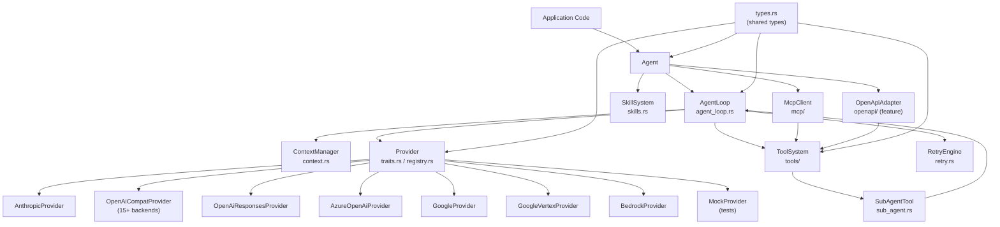
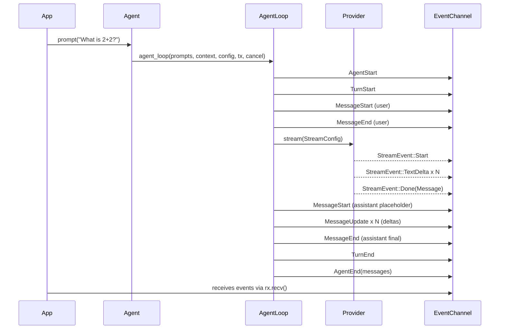
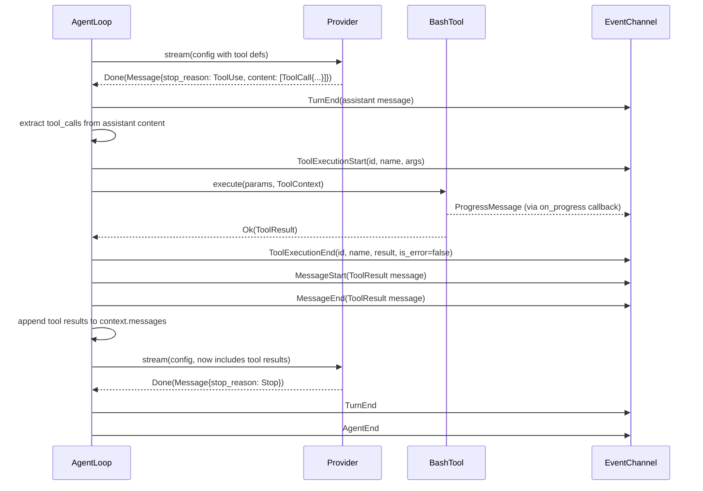
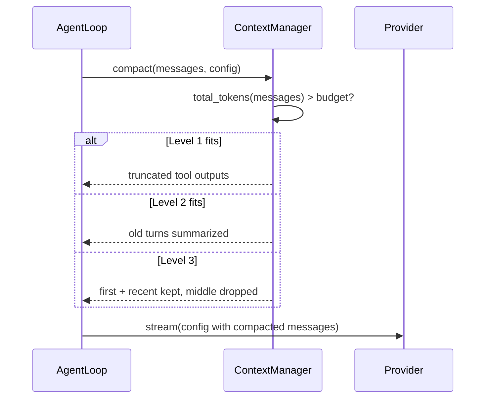
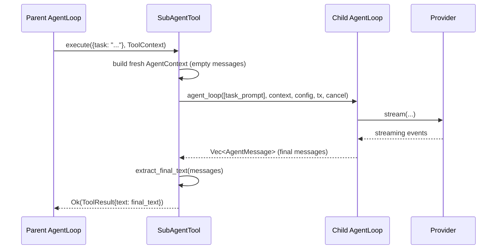

# phi-core — System Architecture

## 1. Component Map

### Agent (`src/agent.rs`)
**Responsibility:** Stateful wrapper that owns the conversation and all configuration. The application-facing API.
**Public interface:**
- `prompt(text)` — Send a text prompt; returns an event stream receiver.
- `prompt_messages(messages)` — Send one or more messages as a prompt; returns an event stream receiver.
- `prompt_with_sender(text, tx)` — Send a text prompt, streaming events to a caller-provided sender.
- `steer(msg)` — Queue a message that will be injected mid-run between tool executions.
- `follow_up(msg)` — Queue a message to be processed after the agent would otherwise stop.
- `abort()` — Cancel the in-progress run by signalling the cancellation token.
- `reset()` — Clear messages, queues, streaming state, and cancel token to return the agent to its initial state.
- `save_messages()` — Serialize the current conversation to a JSON string.
- `restore_messages(json)` — Replace the current conversation with messages deserialized from a JSON string.
- `with_skills(skill_set)` — Load skills and append their XML index to the system prompt per the AgentSkills standard.
- `with_mcp_server_stdio(cmd, args, env)` — Connect to an MCP server by spawning a child process and add its tools to the agent.
- `with_mcp_server_http(url)` — Connect to an MCP server via HTTP and add its tools to the agent.
- `with_openapi_file(path, config, filter)` — Load tools from an OpenAPI spec file and add them to the agent.
- `with_openapi_url(url, config, filter)` — Fetch an OpenAPI spec from a URL and add its tools to the agent.
- `with_openapi_spec(spec_str, config, filter)` — Parse an OpenAPI spec string (JSON or YAML) and add its tools to the agent.

### AgentLoop (`src/agent_loop.rs`)
**Responsibility:** The core execution engine. Manages the turn loop, tool dispatch, steering injection, follow-up processing, and lifecycle event emission.
**Public interface:**
- `agent_loop(prompts, context, config, tx, cancel)` — Start an agent run from new prompt messages, applying input filters, emitting lifecycle events, and returning all new messages produced.
- `agent_loop_continue(context, config, tx, cancel)` — Resume from existing context (no new prompts); used for retries after errors or mid-conversation continuation.

### ContextManager (`src/context.rs`)
**Responsibility:** Token estimation, tiered context compaction, and execution limit tracking.
**Public interface:**
- `estimate_tokens(text)` — Rough token count heuristic: ~4 characters per token.
- `compact_messages(messages, config)` — Reduce message list to fit token budget using a tiered strategy: truncate tool outputs → summarize old turns → drop middle messages.
- `CompactionStrategy` *(trait)* — Interface for custom compaction logic; default implementation uses the 3-tier cascade.
- `ContextTracker` — Tracks context window usage by combining provider-reported token counts with local estimates for recent messages.
- `ExecutionTracker` — Tracks turns, cumulative tokens, and elapsed time against configured limits; signals when any limit is exceeded.
- `ContextConfig` — Tuning knobs for compaction: token budget, system-prompt overhead, head/tail message preservation counts, per-tool-output line limit.
- `ExecutionLimits` — Hard caps on agent execution: max turns, max total tokens, max wall-clock duration.

### ProviderRegistry (`src/provider/registry.rs`, `src/provider/mod.rs`)
**Responsibility:** Dispatches `StreamConfig` to the correct provider implementation based on `ApiProtocol`.
**Public interface:**
- `ProviderRegistry::new()` — Create an empty registry; use `ProviderRegistry::default()` to pre-register all built-in providers.
- *(implements `StreamProvider`)* — Each individual provider also directly implements `StreamProvider` for use without a registry.

### StreamProvider implementations (`src/provider/`)
**Responsibility:** Translate the unified `StreamConfig` into provider-specific HTTP requests and parse streaming responses back into `StreamEvent`s.
**Providers:** `AnthropicProvider`, `OpenAiCompatProvider` (15+ backends), `OpenAiResponsesProvider`, `AzureOpenAiProvider`, `GoogleProvider`, `GoogleVertexProvider`, `BedrockProvider`, `MockProvider`.
**Public interface:** `StreamProvider::stream(config, tx, cancel) -> Result<Message, ProviderError>`.

### ToolSystem (`src/tools/`)
**Responsibility:** Built-in tool implementations. Each implements `AgentTool`.
**Tools:** `BashTool` (shell execution), `ReadFileTool` (text + image files), `WriteFileTool` (create/overwrite), `EditFileTool` (surgical search/replace), `ListFilesTool` (directory listing), `SearchTool` (grep/ripgrep).
**Public interface:**
- `default_tools()` — Returns the standard built-in toolset: bash, read-file, write-file, edit-file, list-files, search.
- `AgentTool::name()` — Unique tool identifier used in LLM tool-use calls and event correlation.
- `AgentTool::label()` — Human-readable display name for UI.
- `AgentTool::description()` — Free-text description sent to the LLM to explain when to use the tool.
- `AgentTool::parameters_schema()` — JSON Schema object describing the tool's accepted parameters.
- `AgentTool::execute(params, ctx)` — Run the tool with resolved parameters and a context carrying the cancellation token and progress callbacks.

### SubAgentTool (`src/sub_agent.rs`)
**Responsibility:** Implements `AgentTool` to delegate tasks to a child `agent_loop()` with isolated context, its own toolset, and a turn limit.
**Public interface:**
- `SubAgentTool::new(name, provider).with_*(...)` — Construct a sub-agent tool with its own system prompt, model, toolset, and turn limit, then register it as an `AgentTool`.

### SkillSystem (`src/skills.rs`)
**Responsibility:** Loads `SKILL.md` files from one or more directories, parses YAML frontmatter, and formats them as an XML index injected into the system prompt.
**Public interface:**
- `SkillSet::load(dirs)` — Load skills from multiple directories; later entries override earlier ones on name conflict.
- `SkillSet::load_dir(dir, source)` — Load skills from a single directory, tagging each with a source label.
- `SkillSet::merge(other)` — Merge another `SkillSet` in; the other's skills override on name conflict.
- `SkillSet::format_for_prompt()` — Render the skill list as an `<available_skills>` XML block ready for system-prompt injection.

### McpClient (`src/mcp/`)
**Responsibility:** MCP client that connects to external tool servers over stdio or HTTP. Adapts discovered tools into `AgentTool` instances.
**Public interface:**
- `McpClient::connect_stdio(cmd, args, env)` — Spawn a child process, complete the JSON-RPC initialize handshake, and return a connected client.
- `McpClient::connect_http(url)` — Connect to an HTTP-based MCP server and complete the initialize handshake.
- `McpToolAdapter::from_client(client)` — Query the server for available tools and return one `AgentTool` adapter per tool.

### OpenApiAdapter (`src/openapi/`, feature-gated)
**Responsibility:** Parses OpenAPI 3.x specs and generates one `AgentTool` per operation. Each tool makes an HTTP request to the spec's base URL.
**Public interface:**
- `from_file(path, config, filter)` — Parse an OpenAPI spec from a local file and return one tool adapter per matching operation.
- `from_url(url, config, filter)` — Fetch an OpenAPI spec over HTTP and return one tool adapter per matching operation.
- `from_str(spec, config, filter)` — Parse an OpenAPI spec from an in-memory string (auto-detects JSON vs YAML) and return one tool adapter per matching operation.
**Availability:** Only compiled when the `openapi` feature flag is enabled.

### RetryEngine (`src/retry.rs`)
**Responsibility:** Computes exponential-backoff delay with ±20% jitter. Classifies which errors are retryable.
**Public interface:**
- `RetryConfig` — Parameters for automatic retry: initial delay, backoff multiplier, max delay, max attempt count.
- `RetryConfig::delay_for_attempt(attempt)` — Compute the sleep duration before attempt N using exponential backoff with ±20% jitter.
- `is_retryable()` *(on `ProviderError`)* — Returns true only for `RateLimited` and `Network` variants; all other errors fail immediately.
- `retry_after()` *(on `ProviderError`)* — Extracts the server-specified retry delay from a `RateLimited { retry_after_ms: Some(...) }` error, if present.

---

## 2. Dependency Graph



---

## 3. Data Flow

### 3.1 Simple Text Prompt (no tool calls)



### 3.2 Tool Call Cycle



### 3.3 Context Compaction Trigger



### 3.4 Sub-Agent Delegation



---

## 4. Data Models

### Content
```
Entity: Content (enum)
  Variant Text:
    text: String               [the text content]
  Variant Image:
    data: String               [base64-encoded binary]
    mime_type: String          [e.g. "image/png", "image/jpeg"]
  Variant Thinking:
    thinking: String           [internal reasoning text]
    signature: Option<String>  [provider-specific thinking signature, optional]
  Variant ToolCall:
    id: String                 [unique call ID, e.g. UUID]
    name: String               [tool name matching AgentTool::name()]
    arguments: JSON            [parameter values matching tool's JSON Schema]

Serialization: tagged by "type" field ("text", "image", "thinking", "toolCall")
```

### Message
```
Entity: Message (enum)
  Variant User:
    content: Vec<Content>      [usually a single Text block]
    timestamp: u64             [unix milliseconds]
  Variant Assistant:
    content: Vec<Content>      [text, thinking, tool call blocks]
    stop_reason: StopReason    [why the model stopped]
    model: String              [model ID returned by provider]
    provider: String           [provider name, e.g. "anthropic"]
    usage: Usage               [token counts for this turn]
    timestamp: u64             [unix milliseconds]
    error_message: Option<String>  [set when stop_reason == Error]
  Variant ToolResult:
    tool_call_id: String       [matches Content::ToolCall.id]
    tool_name: String          [matches Content::ToolCall.name]
    content: Vec<Content>      [tool output, usually a Text block]
    is_error: bool             [true if tool execution failed]
    timestamp: u64             [unix milliseconds]

Lifecycle: User messages are created by the caller. Assistant messages are
           created by the provider after streaming completes. ToolResult messages
           are created by the agent loop after tool execution.
```

### AgentMessage
```
Entity: AgentMessage (enum, untagged)
  Variant Llm(Message)          [sent to the LLM; user/assistant/toolResult roles]
  Variant Extension(ExtensionMessage)  [not sent to LLM; app-only metadata]

Note: stored in Agent.messages and AgentContext.messages
      Extension messages are filtered out before LLM calls
```

### ExtensionMessage
```
Entity: ExtensionMessage
  role: String        [always "extension"]
  kind: String        [app-defined event type, e.g. "ui_update"]
  data: JSON          [arbitrary app-defined payload]
```

### StopReason
```
Entity: StopReason (enum)
  Stop      -> model completed naturally
  Length    -> max_tokens limit hit
  ToolUse   -> model returned tool calls (loop must continue)
  Error     -> provider or streaming error occurred
  Aborted   -> cancellation token was triggered

Serialization: camelCase ("stop", "length", "toolUse", "error", "aborted")
```

### Usage
```
Entity: Usage
  input: u64          [prompt tokens processed]
  output: u64         [completion tokens generated]
  cache_read: u64     [tokens served from prompt cache]
  cache_write: u64    [tokens written to prompt cache]
  total_tokens: u64   [sum, may be 0 if not reported]

Derived: cache_hit_rate() = cache_read / (input + cache_read + cache_write)
```

### AgentEvent
```
Entity: AgentEvent (enum)
  AgentStart                          [loop began]
  AgentEnd { messages: Vec<AgentMessage> }  [loop finished; all new messages]
  TurnStart                           [LLM call about to begin]
  TurnEnd { message, tool_results }   [LLM call + tools complete]
  MessageStart { message }            [message streaming began]
  MessageUpdate { message, delta }    [content delta arrived]
  MessageEnd { message }              [message complete]
  ToolExecutionStart { tool_call_id, tool_name, args }
  ToolExecutionUpdate { tool_call_id, tool_name, partial_result }  [progress]
  ToolExecutionEnd { tool_call_id, tool_name, result, is_error }
  ProgressMessage { tool_call_id, tool_name, text }  [user-facing status text]
  InputRejected { reason }            [input filter blocked the prompt]
```

### StreamDelta
```
Entity: StreamDelta (enum)
  Text { delta: String }              [text content chunk]
  Thinking { delta: String }          [thinking content chunk]
  ToolCallDelta { delta: String }     [tool call argument chunk]
```

### ToolContext
```
Entity: ToolContext
  tool_call_id: String               [for correlation with AgentEvent]
  tool_name: String                  [for correlation with AgentEvent]
  cancel: CancellationToken          [check is_cancelled() in long-running tools]
  on_update: Option<ToolUpdateFn>    [callback for streaming partial ToolResults]
  on_progress: Option<ProgressFn>    [callback for user-facing status text]
```

### ToolResult / ToolError
```
Entity: ToolResult
  content: Vec<Content>   [tool output content blocks]
  details: JSON           [structured metadata, not sent to LLM, e.g. exit_code]

Entity: ToolError (enum)
  Failed(String)          [general execution failure]
  NotFound(String)        [tool name not in registry]
  InvalidArgs(String)     [parameter validation failed]
  Cancelled               [CancellationToken was triggered]
```

### ContextConfig
```
Entity: ContextConfig
  max_context_tokens: usize     [default: 100,000; total budget including system prompt]
  system_prompt_tokens: usize   [default: 4,000; reserved for system prompt]
  keep_recent: usize            [default: 10; messages always kept in full at tail]
  keep_first: usize             [default: 2; messages always kept at head]
  tool_output_max_lines: usize  [default: 50; L1 compaction per-tool-output limit]

Effective budget = max_context_tokens - system_prompt_tokens
```

### ExecutionLimits / ExecutionTracker
```
Entity: ExecutionLimits
  max_turns: usize              [default: 50; LLM calls before forced stop]
  max_total_tokens: usize       [default: 1,000,000; cumulative token budget]
  max_duration: Duration        [default: 600s; wall-clock time limit]

Entity: ExecutionTracker (runtime state)
  limits: ExecutionLimits       [immutable config]
  turns: usize                  [incremented after each LLM call]
  tokens_used: usize            [cumulative; updated from provider Usage]
  started_at: Instant           [set on construction]
```

### RetryConfig
```
Entity: RetryConfig
  max_retries: usize            [default: 3; 0 = no retries]
  initial_delay_ms: u64         [default: 1,000ms]
  backoff_multiplier: f64       [default: 2.0; exponential growth factor]
  max_delay_ms: u64             [default: 30,000ms; ceiling before jitter]
```

### CacheConfig / CacheStrategy
```
Entity: CacheConfig
  enabled: bool                 [master switch; default: true]
  strategy: CacheStrategy

Entity: CacheStrategy (enum)
  Auto                          [provider places breakpoints automatically]
  Disabled                      [no caching hints sent]
  Manual {
    cache_system: bool          [cache system prompt]
    cache_tools: bool           [cache tool definitions]
    cache_messages: bool        [cache second-to-last message]
  }
```

### StreamConfig (sent to provider)
```
Entity: StreamConfig
  model: String
  system_prompt: String
  messages: Vec<Message>        [LLM-only messages, Extension filtered out]
  tools: Vec<ToolDefinition>    [schema-only; no execute functions]
  thinking_level: ThinkingLevel
  api_key: String
  max_tokens: Option<u32>
  temperature: Option<f32>
  model_config: Option<ModelConfig>
  cache_config: CacheConfig
```

### ToolDefinition (sent to LLM)
```
Entity: ToolDefinition
  name: String              [matches AgentTool::name()]
  description: String       [matches AgentTool::description()]
  parameters: JSON          [JSON Schema object matching AgentTool::parameters_schema()]
```

### Skill / SkillSet
```
Entity: Skill
  name: String              [from YAML frontmatter; skill identifier]
  description: String       [from YAML frontmatter; one-line capability summary]
  file_path: PathBuf        [absolute path to the SKILL.md file]
  base_dir: PathBuf         [absolute path to the skill's directory]
  source: String            [origin label: "dir:0", "dir:1", etc.]

Entity: SkillSet
  skills: Vec<Skill>

Lifecycle: Loaded from disk at startup via SkillSet::load(dirs).
           Formatted as XML via format_for_prompt() and appended to system prompt.
           Agent reads full SKILL.md on-demand when activating a skill via read_file tool.
```

### QueueMode
```
Entity: QueueMode (enum) — controls steering/follow-up queue delivery

  OneAtATime   pop and return exactly one message per call (default)
  All          drain and return all queued messages at once

Used in: Agent.steering_mode, Agent.follow_up_mode
```

### McpToolInfo / McpContent
```
Entity: McpToolInfo — tool metadata returned by MCP server
  name: String                  [tool identifier used in tools/call]
  description: Option<String>   [human-readable description; default empty string]
  inputSchema: JSON             [JSON Schema for the tool's parameters]

Entity: McpContent (enum) — content item in a tool call result
  Variant Text:
    type: "text"
    text: String
  Variant Image:
    type: "image"
    data: String    [base64-encoded]
    mimeType: String

Entity: McpToolCallResult
  content: Vec<McpContent>  [output from the tool]
  isError: bool             [true if the tool reported an error]
```

### OpenApiConfig / OpenApiAuth / OperationFilter
```
Entity: OpenApiConfig — configuration for OpenAPI tool generation
  base_url: Option<String>          [overrides spec servers[0].url; trailing slash stripped]
  auth: OpenApiAuth                 [authentication method]
  custom_headers: Map<String,String> [extra headers added to every request]
  max_response_bytes: usize         [default: 65536 (64KB); response body truncation limit]
  timeout_secs: u64                 [default: 30; per-request timeout]
  name_prefix: Option<String>       [if set, tool names formatted as "{prefix}__{operationId}"]

Entity: OpenApiAuth (enum)
  None                              [no authentication]
  Bearer(token: String)             [Authorization: Bearer {token}]
  ApiKey { header: String, value: String }  [custom header: {header}: {value}]

Note: Bearer token and ApiKey value are redacted as "****" in debug output.

Entity: OperationFilter (enum) — controls which API operations become tools
  All                               [include all operations that have an operationId]
  ByOperationId(Vec<String>)        [include only operations whose id is in the list]
  ByTag(Vec<String>)                [include operations tagged with any listed tag]
  ByPathPrefix(String)              [include operations whose path starts with the prefix]
```

---

## 5. Integration Contracts

### Anthropic Messages API
- **Endpoint:** `https://api.anthropic.com/v1/messages`
- **Auth (standard):** `x-api-key: {ANTHROPIC_API_KEY}` + `anthropic-version: 2023-06-01`
- **Auth (OAuth):** `authorization: Bearer {TOKEN}` + beta headers `claude-code-20250219,oauth-2025-04-20,fine-grained-tool-streaming-2025-05-14`; `x-app: cli`; `anthropic-dangerous-direct-browser-access: true`; `user-agent: claude-cli/2.1.2`
- **Request:** POST JSON with `model`, `system` (array of text blocks), `messages`, `tools`, `max_tokens` (default 8192), `stream: true`
- **Response:** Server-Sent Events stream; events: `message_start`, `content_block_start`, `content_block_delta`, `message_delta`, `message_stop`
- **Tool args:** Streamed as `InputJsonDelta` text fragments; buffered in `arguments["__partial_json"]`; parsed as complete JSON on `content_block_stop`
- **Thinking:** `ThinkingLevel` mapped to `{type:"enabled", budget_tokens: N}` — Minimal→128, Low→512, Medium→2048, High→8192
- **Prompt caching:** `cache_control: {type: "ephemeral"}` placed at system/last-tool-def/second-to-last-message per `CacheStrategy`
- **Content format:** `{type: "text"|"image"|"thinking"|"tool_use"|"tool_result", ...}`
- **Tool results:** Role "user", type "tool_result", fields: `tool_use_id`, `content`, `is_error`

### OpenAI-Compatible APIs (Chat Completions)
- **Endpoints:** `https://api.openai.com/v1/chat/completions` and 14+ compatible bases (xAI/Grok, Groq, Cerebras, Mistral, DeepSeek, etc.)
- **Auth:** `Authorization: Bearer {API_KEY}`
- **Request:** POST JSON with `model`, `messages`, `tools`, `stream: true`, `stream_options: {include_usage: true}`
- **max_tokens field name:** `"max_tokens"` (most) or `"max_completion_tokens"` (OpenAI) — controlled by `OpenAiCompat.max_tokens_field`
- **System prompt:** First message with role `"system"` or `"developer"` (OpenAI) — controlled by `supports_developer_role`
- **Thinking:** `reasoning_effort: "low"|"medium"|"high"` if `supports_reasoning_effort`; response in `delta.reasoning_content` (OpenAI) or `delta.reasoning` (xAI)
- **Response:** SSE stream; each chunk has `choices[0].delta`; tool args in `delta.tool_calls[].function.arguments` (incremental JSON string)

### OpenAI Responses API
- **Endpoint:** `{base_url}/responses`
- **Auth:** `Authorization: Bearer {OPENAI_API_KEY}`
- **System prompt:** `"instructions"` field (not `"messages"`)
- **Message format:** Different from Chat Completions — see Bedrock/Responses comparison below
- **Thinking:** `"reasoning": {effort: "low"|"medium"|"high"}` field
- **SSE events:** `response.output_text.delta`, `response.reasoning.delta`, `response.function_call_arguments.start/delta/done`, `response.completed`

### Azure OpenAI
- **Endpoint:** `{base_url}/responses?api-version=2025-01-01-preview` (base_url pattern: `https://{resource}.openai.azure.com/openai/deployments/{deployment}`)
- **Auth:** `api-key: {AZURE_OPENAI_API_KEY}` header (**not** `Authorization: Bearer`)
- **Request/Response:** Same format as OpenAI Responses API

### Google Generative AI (Gemini)
- **Endpoint:** `{base_url}/v1beta/models/{model}:streamGenerateContent?alt=sse&key={API_KEY}`
- **Auth:** API key as URL query parameter `?key=`; no Authorization header
- **System prompt:** `"systemInstruction": {parts: [{text: "..."}]}`
- **Tools:** Single object `{functionDeclarations: [...]}` wrapping all tool definitions
- **Contents:** Role "user" or "model"; ToolResults sent as `{role:"user", parts:[{functionResponse:{name, response:{result: text}}}]}`
- **Tool args:** Delivered **complete** in one event (no streaming deltas); tool IDs auto-generated as `"google-fc-{index}"`
- **Response parsing:** Custom SSE parser (not standard library); splits on `\n\n`, extracts `data: ` line

### Google Vertex AI
- **Endpoint:** `https://{region}-aiplatform.googleapis.com/v1/projects/{project}/locations/{region}/publishers/google/models/{model}:streamGenerateContent?alt=sse`
- **Auth:** `Authorization: Bearer {OAUTH_TOKEN}` (OAuth2, not API key in URL)
- **Request/Response:** Identical to Google Generative AI; tool IDs generated as `"vertex-fc-{index}"`

### Amazon Bedrock (ConverseStream)
- **Endpoint:** `{base_url}/model/{model}/converse-stream` (base_url: `https://bedrock-runtime.{region}.amazonaws.com`)
- **Auth:** `Authorization: Bearer {token}` or custom headers from `model_config.headers`; minimal SigV4 support
- **System prompt:** `"system"` array: `[{text: "..."}]`
- **Tools:** `toolConfig.tools`: `[{toolSpec: {name, description, inputSchema: {json: schema}}}]`
- **Tool results:** `{toolResult: {toolUseId, content: [...], status: "success"|"error"}}`
- **Streaming format:** Newline-delimited JSON (**not** standard SSE); events: `contentBlockDelta`, `contentBlockStart`, `contentBlockStop`, `messageStop`, `metadata`

### Model Context Protocol (MCP)
- **Protocol:** JSON-RPC 2.0
- **Message types:**
  - Request: `{jsonrpc:"2.0", id:u64, method:String, params:Option<Value>}`
  - Response: `{jsonrpc:"2.0", id:Option<u64>, result:Option<Value>, error:Option<{code:i64,message:String,data?}>}`
  - Request IDs: auto-incremented `AtomicU64` starting at 1

- **Initialization handshake (3 steps):**
  1. Client sends `initialize` with `{protocolVersion:"2024-11-05", capabilities:{}, clientInfo:{name:"phi-core",version:"<pkg>"}}`
  2. Server responds with `{protocolVersion, capabilities:{tools?,resources?,prompts?}, serverInfo:{name,version}}`
  3. Client sends `notifications/initialized` notification (no params; server may ignore id)

- **Tool discovery:** Client sends `tools/list` → server returns `{tools: [{name, description?, inputSchema}]}`
- **Tool execution:** Client sends `tools/call {name, arguments}` → server returns `{content:[{type:"text",text}|{type:"image",data,mimeType}], isError:bool}`

- **Stdio transport:** Spawns child process; newline-delimited JSON over stdin/stdout; `tokio::sync::Mutex` for concurrent access; shutdown: EOF on stdin then kill child
- **HTTP transport:** POST JSON-RPC body to configured URL; stateless (no persistent connection)

- **Tool adapter:** `McpToolAdapter` wraps `McpToolInfo` + `Arc<Mutex<McpClient>>`; optional `prefix` for namespace disambiguation (`{prefix}__{name}`)
- **Error enum:** `Transport(String)`, `Protocol(String)`, `JsonRpc{code,message}`, `Serialization`, `Io`, `ConnectionClosed`

### OpenAPI
- **Spec formats:** OpenAPI 3.x; auto-detected: first non-whitespace char `{` or `[` → JSON, else YAML
- **Sources:** `from_file(path)` (async read), `from_url(url)` (HTTP GET via reqwest), `from_str(text)` (in-memory)
- **Base URL resolution:** `config.base_url` → `spec.servers[0].url` → error if neither set; trailing slashes stripped

- **Parameter classification:**
  - `Path` parameters → URL `{param}` substitution (RFC 3986 percent-encoding); required
  - `Query` parameters → `.query()` chains; optional
  - `Header` parameters → `.header()` chains; optional
  - `Cookie` parameters → skipped (unsupported)
  - `RequestBody` (application/json only) → keyed as `"body"` (or `"_request_body"` on collision); required if `requestBody.required`

- **HTTP execution pipeline (per tool call):**
  1. Validate params is object (or null treated as `{}`)
  2. Substitute path params with percent-encoded values; error if any missing
  3. Build URL: `{base_url}{path}`
  4. Chain `.query()` for query params present in input
  5. Chain `.header()` for header params present in input
  6. Apply auth: `Bearer` → `.bearer_auth()`, `ApiKey` → `.header(header, value)`, `None` → nothing
  7. Apply `custom_headers`
  8. If `has_body`: `.json(params["body"])`
  9. Send request; read full body text; truncate to `max_response_bytes` at UTF-8 boundary
  10. Return: `"{METHOD} {URL} → {STATUS_CODE}\n\n{BODY}"`

- **Operation filter:** `OperationFilter::All|ByOperationId|ByTag|ByPathPrefix`; operations without `operationId` always skipped with warning
- **Tool naming:** Default = `operationId`; with prefix = `{prefix}__{operationId}`

### File System
- **Read:** `tokio::fs::read_to_string` for text (max 1MB), `tokio::fs::read` for images (max 20MB)
- **Write:** `tokio::fs::write` with automatic parent dir creation
- **Edit:** Read → string replace (exact match, once) → write
- **List:** Spawns `find` command via BashTool
- **Search:** Spawns `grep` or `rg` command via BashTool

### Shell
- **Execution:** `tokio::process::Command::new("bash").arg("-c").arg(command)`
- **Timeout:** `tokio::time::sleep` with default 120s, configurable
- **Output capture:** `stdout` + `stderr` piped, truncated at 256KB each
- **Safety:** Deny patterns checked before execution (substring match)
- **Exit code:** Returned in `ToolResult.details.exit_code`; tool always returns Ok (non-zero is not a ToolError)

---

## 6. State Management

### Agent-Level State (in `Agent` struct)

All fields on `Agent`:

| Field | Type | Notes |
|---|---|---|
| `system_prompt` | `String` | Immutable once set; injected into every LLM call |
| `model` | `String` | Model identifier |
| `api_key` | `String` | API authentication key |
| `thinking_level` | `ThinkingLevel` | Off/Minimal/Low/Medium/High |
| `max_tokens` | `Option<u32>` | Max completion tokens |
| `temperature` | `Option<f32>` | Sampling temperature |
| `model_config` | `Option<ModelConfig>` | Provider-specific extras (base_url, headers, compat flags) |
| `messages` | `Vec<AgentMessage>` | Grows on each `prompt()` call; reset by `reset()`; replaced by `restore_messages()` |
| `tools` | `Vec<Box<dyn AgentTool>>` | Tool instances (heap-allocated trait objects) |
| `provider` | `Box<dyn StreamProvider>` | **Boxed**, not Arc; owned exclusively by Agent |
| `steering_queue` | `Arc<Mutex<Vec<AgentMessage>>>` | Written by `steer()`, drained by agent loop before each tool execution check |
| `follow_up_queue` | `Arc<Mutex<Vec<AgentMessage>>>` | Written by `follow_up()`, drained when agent loop would stop |
| `steering_mode` | `QueueMode` | Default: `OneAtATime` |
| `follow_up_mode` | `QueueMode` | Default: `OneAtATime` |
| `context_config` | `Option<ContextConfig>` | If None, context compaction is disabled |
| `execution_limits` | `Option<ExecutionLimits>` | If None, no hard limits enforced |
| `cache_config` | `CacheConfig` | Prompt caching hints (Anthropic) |
| `tool_execution` | `ToolExecutionStrategy` | Parallel (default), Sequential, or Batched |
| `retry_config` | `RetryConfig` | Backoff for RateLimited/Network errors |
| `before_turn` | `Option<BeforeTurnFn>` | Signature: `fn(&[AgentMessage], turn_number: usize) -> bool`; return false to abort |
| `after_turn` | `Option<AfterTurnFn>` | Signature: `fn(&[AgentMessage], &Usage)` |
| `on_error` | `Option<OnErrorFn>` | Signature: `fn(&str)` |
| `input_filters` | `Vec<Arc<dyn InputFilter>>` | Applied in order before LLM call |
| `compaction_strategy` | `Option<Arc<dyn CompactionStrategy>>` | Overrides default 3-tier compaction |
| `cancel` | `Option<CancellationToken>` | Created when `prompt()` starts, consumed by `abort()` |
| `is_streaming` | `bool` | Set true on `prompt()` entry, false on exit |

**Invariants:**
- `assert!(!self.is_streaming)` fires if `prompt()` is called while already running — callers must use `steer()` or `follow_up()` during active runs
- `cancel` is always `Some` while `is_streaming` is true
- `messages` must not end in an `Assistant` message before `agent_loop_continue()` is called

### AgentContext (per-run, passed into agent loop)
| State Element | Description |
|---|---|
| `system_prompt` | Immutable for the duration of the run |
| `messages` | Mutated in-place: prompts appended, assistant messages appended, tool results appended; may be replaced by compaction |
| `tools` | Immutable for the duration of the run |

### ExecutionTracker (per-run)
| State | Initial | Transitions |
|---|---|---|
| `turns` | 0 | Incremented after each LLM call |
| `tokens_used` | 0 | Incremented by token count of each LLM response |
| `started_at` | Instant::now() | Immutable; compared against `max_duration` on each check |

### Steering/Follow-up Queue Modes
- **`QueueMode::OneAtATime`** (default for both queues): on each read, lock mutex, pop the *first* message only, return as `Vec` of 1
- **`QueueMode::All`**: on each read, lock mutex, drain *all* queued messages, return the full vec

Both queues are passed to `AgentLoopConfig` as closures (`get_steering_messages`, `get_follow_up_messages`) that capture the `Arc<Mutex<>>` pointer, enabling external callers to enqueue messages while the agent loop is running on another task.

---

## 7. Error Handling Strategy

### Provider Errors (`ProviderError`)
| Error | Retryable | Handling |
|---|---|---|
| `RateLimited { retry_after_ms }` | Yes | Exponential backoff; respects `Retry-After` header if present |
| `Network(msg)` | Yes | Exponential backoff |
| `Auth(msg)` | No | Propagated immediately as `StopReason::Error` message |
| `Api(msg)` | No | Propagated as `StopReason::Error` message |
| `ContextOverflow { msg }` | No | Detected on HTTP 400/413; triggers compaction on next turn (see below) |
| `Cancelled` | No | Loop exits cleanly, `AgentEnd` emitted |
| `Other(msg)` | No | Propagated as `StopReason::Error` message |

### Context Overflow Recovery
1. Provider returns HTTP 400/413 matching any of 15+ known overflow phrases.
2. `ProviderError::classify()` returns `ContextOverflow`.
3. The overflow may arrive as an HTTP error (caught in retry loop) or as a streaming error event (`StreamEvent::Error` with matching message), caught by `Message::is_context_overflow()`.
4. On the next turn, if `context_config` is set, `compact_messages()` is called before the LLM call.
5. If no `context_config` is set, the error message is included in conversation history and the loop continues — the LLM may self-recover or the next turn will also fail.

### Tool Errors (`ToolError`)
- **`Cancelled`:** Tool execution skipped; `ToolResult` content = "Skipped due to queued user message." with `is_error: true`
- **`Failed(msg)`:** Converted to `ToolResult` with error text; `is_error: true`; **always returned to LLM** so it can self-correct
- **`InvalidArgs(msg)`:** Same as Failed; LLM can retry with corrected parameters
- **`NotFound(msg)`:** Produced when tool name in `ToolCall` has no matching `AgentTool`; same handling as Failed

### Input Filter Errors
- **`Reject(reason)`:** Emits `AgentEvent::InputRejected`, immediately emits `AgentEvent::AgentEnd { messages: [] }`, returns empty message list
- **`Warn(msg)`:** Warning text appended to last user message content; loop continues

### Execution Limit Exhaustion
- When any limit is exceeded, a synthetic user message `[Agent stopped: {reason}]` is appended to context and emitted as events.
- Loop returns immediately after appending the message.
- No error is thrown; `AgentEnd` is emitted normally.

### Before-Turn Abort
- If `before_turn` callback returns `false`, the loop returns immediately with no `AgentEnd` emitted.
- This is the only path where `AgentEnd` is not guaranteed.

### Error Propagation Across Components
```
Provider → ProviderError → stream_assistant_response() → Message{stop_reason: Error}
                                                        ↓
                                            on_error callback invoked
                                                        ↓
                                        AgentEvent::TurnEnd emitted
                                                        ↓
                                           agent loop returns
```
